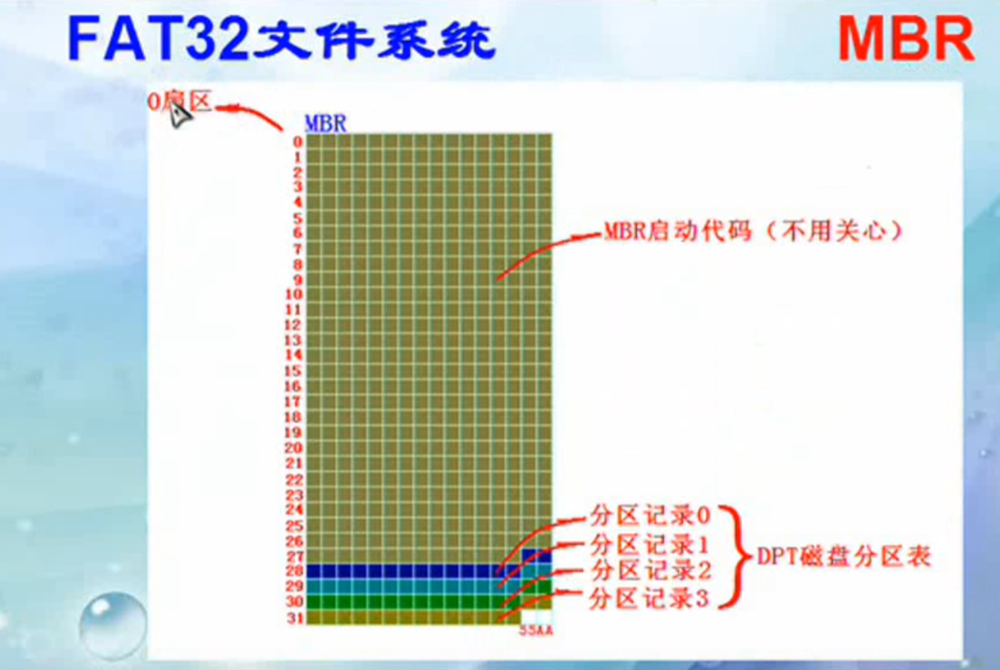
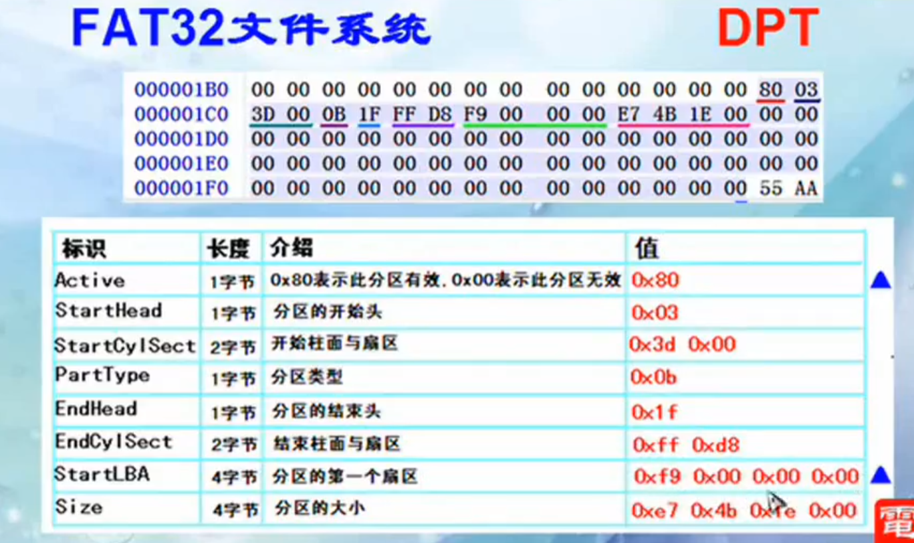
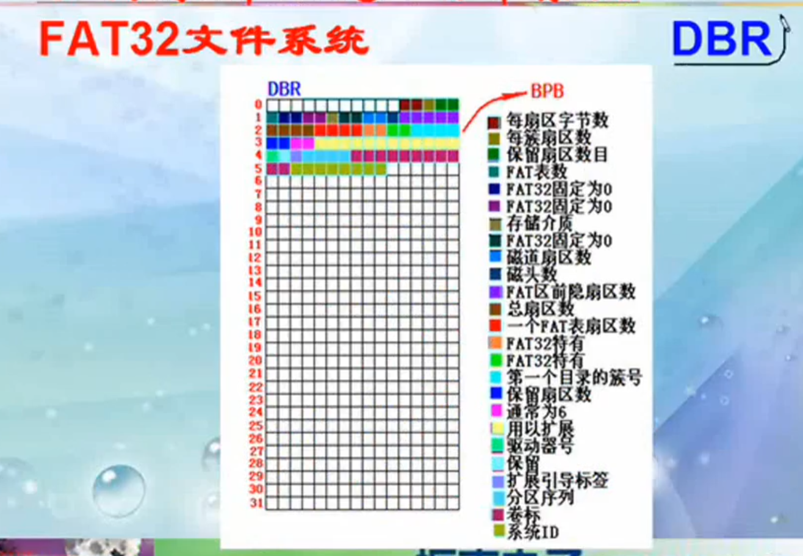
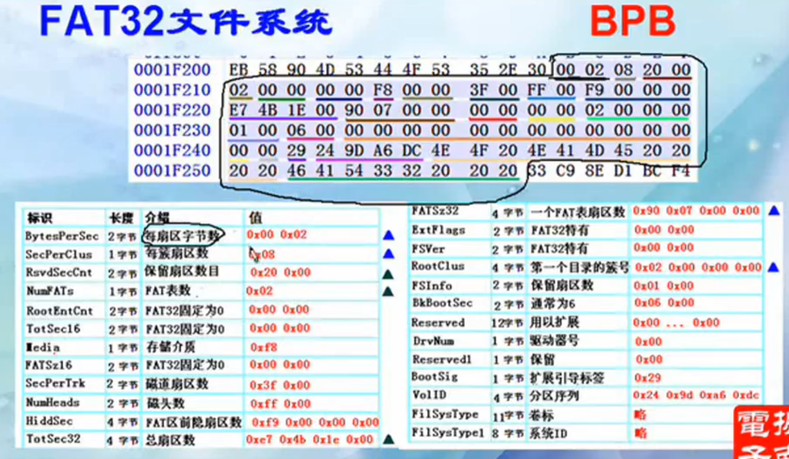
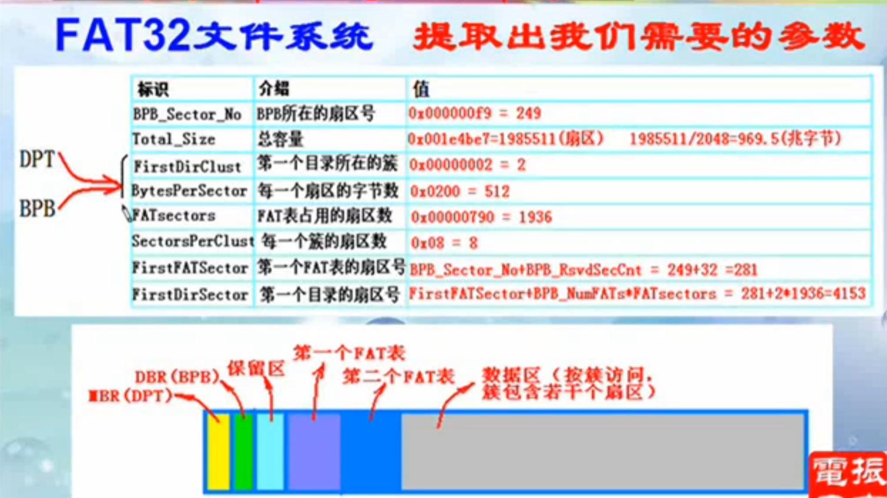
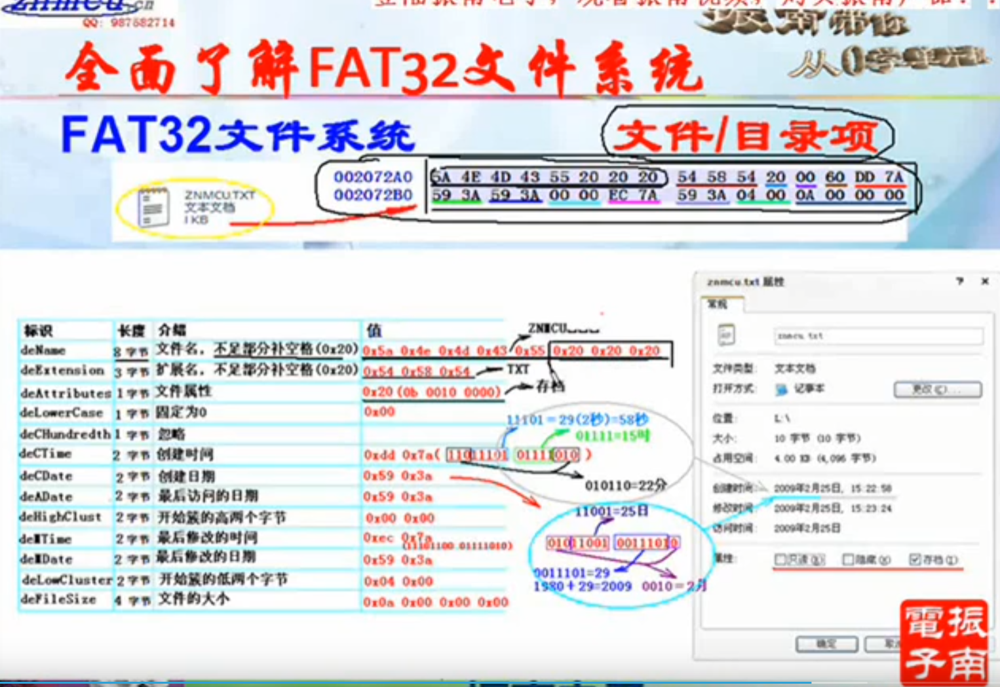
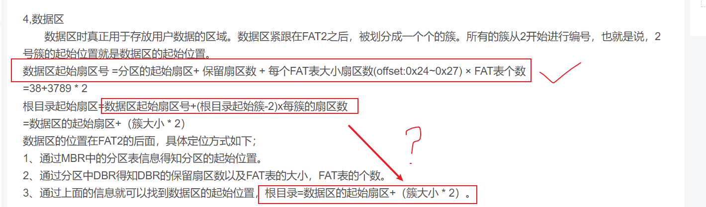
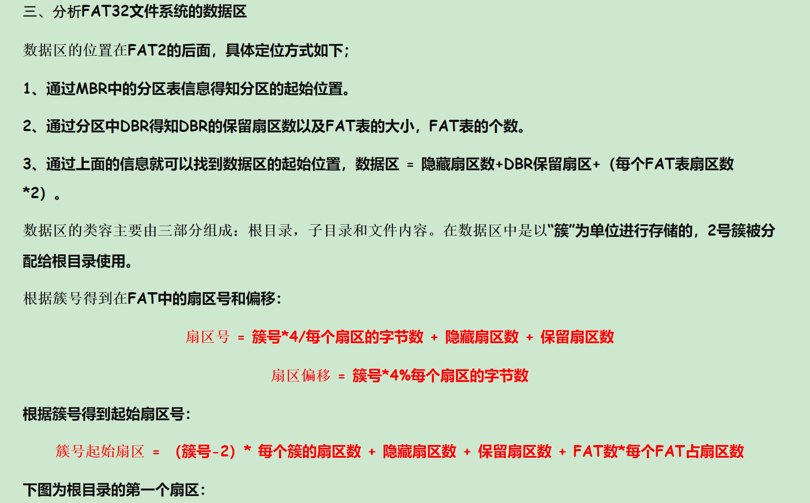

# 开发问题汇总

标志用于区分问题种类，加*号表示 待讨论

- F -----   FileSystem 文件系统
- P -----  Progress 进程 ，限制在进程正常控制流内的工作，包括父子进程
- M -----  Memory 内存管理
- *T ----- trap 中断和异常， 包括系统调用，进程切换，硬件定时器，软件定时器等
- B ----- bug
- *Sch----- 调度Schedule 
- *Syn ---- 同步
- ....

## F001 基于SD卡的FAT32文件系统搭建

2022/5/5 上午 准备 FAT 32 实现计划

​				 中午  开会分配工作

​				 晚上 coding

工作前提：熟悉FAT32格式，了解如何解析磁盘信息；使用提供的SD卡读写某一扇区的驱动

提供功能：

1. 展示SD卡 信息
2. 展示的当前目录下的文件
3. 根据绝对路径读文件（文件名255字节以内）
4. 根据绝对路径创建文件（文件名同上）
5. 根据绝对路径写文件（文件名同上）

注意事项：

​	文件权限控制由操作系统完成

实现的接口：

1. 初始化init： 读取MBR，DBR 信息，获得根目录的簇号

2. 根据当前目录，解析目录项

   /a/b/c.txt

3. 找到文件目录项，读取文件信息

4. 根据目录项起始簇号，读FAT表，确定文件占据的簇

5. 放弃短文件名，仅使用长文件名（32*13）

   - 读长文件名目录项
   - 创建长文件名 ....

**FAT32分区介绍：**

**MBR中DPT 的结构**

**DBR 结构**

开始3字节为 跳转指令 EB 58 90,

0x3 至 0xA共 8字节为 OEM 代号

0xB 至 0x59  为 BPB（BIOS Paramter Block）

**BPB结构**

**数据区**

按簇读取

目录项

问题： 根目录的起始扇区号

## F002 FAT32 并入 VFS

## T001 软硬协同实现Trap 机制

## T002 提高Trap 的效率

1. 处理流程更加简单
2. 恶意软件是否能滥用这里的机制来打破隔离性

