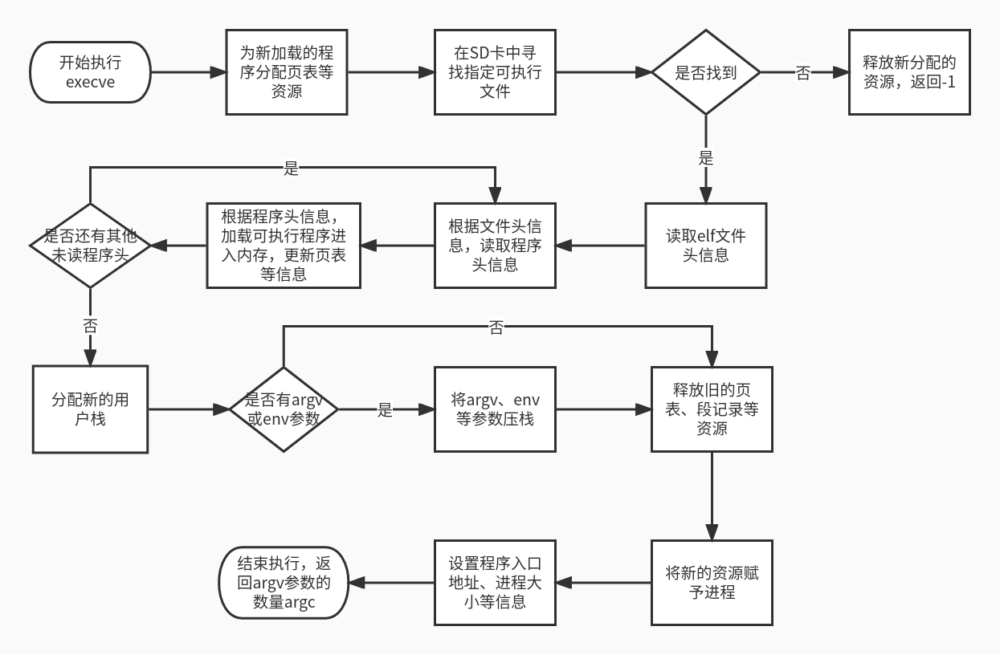
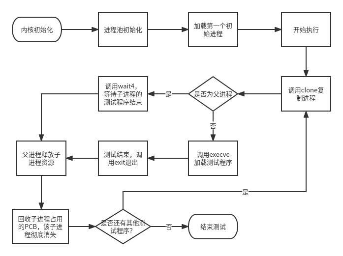

# 进程管理说明文档


### 一、进程PCB描述

​		对于每个进程，都会有对应的PCB结构保存其信息。在testOS中，进程的相关信息被记录在process结构体中（位于process.h），包括进程的pid、进程状态、进程的父进程指针、进程页表指针、进程段信息记录、进程上下文记录、进程大小、进程当前工作目录、进程打开的文件指针等。其具体定义如下所示：

```c
//进程的pcb，保存进程的各种信息
typedef struct process{
  struct spinlock spinlock; //自旋锁

  uint64 kstack;  //内核栈地址
  pagetable_t pagetable;  //页表指针

  //各个程序段的信息，通过这个结构来维护
  segment_map_info *segment_map_info;
  int segment_num;  //记录进程有几个段

  proc_state state; //进程状态
  int exit_state; //进程退出状态
  int killed; //是否被杀死
  int size; //进程在内存中的大小
  uint64 pid; //进程pid

  fat32_dirent *cwd;  //进程当前工作目录的目录项

  //进程打开的文件列表，通过文件描述符来索引
  //这个列表维护的实际上是指向file.c中的文件列表的指针，打开的文件最终由OS维护
  file *open_files[N_OPEN_FILE];  

  struct process *parent; //进程的父进程
  
  //进程可能会被加入一些队列，如就绪队列、睡眠队列，这个指针指向队列中的下一个进程
  struct process *queue_next; 

  //trapframe，在进入内核态的时候保存进程上下文信息
  trapframe *trapframe;

  //进程时间相关
  tms times;  //进程运行时间
  uint64 enter_ktimes;  //上一次进入内核的时间
  uint64 leave_ktimes;  //上一次离开内核的时间

  uint64 sleep_expire;  //睡眠预期唤醒时间

  char name[50];

  //等待子进程结束时，保存wait4参数
  struct {
    int wpid;
    int *wstatus;
    uint64 woptions;
  }wait4_args; 

  mmap_infos mmap_areas[MMAP_NUM];
  uint64 mmap_va_available; //从此地址往后都可以映射
}process;
```

​		每创建一个进程，内核均会为该进程在进程池中记录其PCB信息。进程池定义于process.c文件中，是一个process结构体数组 `process proc_list[NPROC] `，NPROC大小为64，即内核最大支持64个进程同时运行。


### 二、进程初始化

#### 1、进程池初始化 

​		内核启动时，会初始化进程池中的每个process结构体元素。初始化的函数为`proc_list_init`函数，定义于process.c，由`sstart`函数调用。该函数会遍历`proc_list`进程池，初始化各个process元素的pid、内核栈、打开文件列表、上下文信息、段信息等，并将所有process的状态设置为UNUSED，UNUSED表示该process元素未被进程占用，可以被分配给新创建的进程。进程池中每个进程的pid即为该进程的process结构体元素在进程池中的下标加1，即proc_list[0]的pid为1、procl_ist[1]的pid为2...... 以此类推。

#### 2、内核加载第一个进程

​		内核初始化完毕后，就会加载第一个进程。加载第一个进程的函数为`load_user_proc`，定义于process.c。该函数会将test.c编译得到的二进制程序加载入内存中，并在进程池中分配第一个process结构体给该进程，其pid为1，之后会依次初始化其页表、用户栈等内容。test.c被编译后会使用od -t xC指令得到其二进制程序码，将该程序直接写入内核源代码的testcode字段中，内核加载该程序时直接复制testcode字段进入指定的内存位置。

​		第一个进程初始化完毕后，将其插入进程就绪队列`runnable_queue`，之后内核进入`schedule`函数开始进行进程的调度。


### 三、进程创建

​		在第一个初始化进程加载入内核后，之后的进程创建均为以下流程：首先由父进程使用clone系统调用复制出一个子进程，子进程再使用execve将指定的可执行程序加载入内存中，之后继续进行进程的调度。所有具体实施系统调用功能的函数除do_execve外均定义于process.c文件中。

#### 1、进程复制

​		实现进程复制的系统调用为clone，系统调用号为220。

​		父进程调用clone后，经系统调用的工作流程，最终将参数传入`do_clone`函数，`do_clone`函数实际完成clone系统调用的功能，其声明如下：

```c
uint64 do_clone(process *parent, uint64 flag, uint64 stack);
```

​		其中parent为使用该系统调用的进程、flag为参数、stack为指定的子进程用户栈底地址，若为0则由系统为其分配用户栈。

​		`do_clone`执行时，首先调用`alloc_process`函数从进程池为子进程分配一个新的PCB，即process结构体。`alloc_process`遍历进程池，寻找状态为UNUSED的process元素，找到后初始化各种必要信息并分配资源，将process指针返回。

​		`do_clone`函数获得该指针后，则根据parent进程的`segment_map_info`字段将父进程中各个段的内容复制给子进程。`segment_map_info`字段记录了一个进程各程序段的基本信息、包括段起始虚拟地址、段页数、段类型。其定义如下（位于process.h中）：

```c
//管理进程各个段的结构
//这个结构是process的一部分
//包括段的起始虚拟地址，占用的页数，段的类型
typedef struct segment_map_info{
  uint64 va;	//段起始虚拟地址
  int page_num;		//段页数
  int seg_type;		//段类型，包括代码段、堆段、栈段、系统段、设备映射段、程序上下文段
}segment_map_info;

```

​		将父进程的各段复制给子进程后，再将父进程的进程大小、当前工作目录、文件描述符等也复制给子进程，子进程的parent指针指向父进程，进程状态设置为READY。如果stack参数不为0，则将子进程的用户栈底设置为stack。由于clone系统调用会给子进程返回0，因此给子进程上下文的a0寄存器字段赋值为0。最后，子进程被插入就绪队列等待调度，`do_clone`函数将子进程的pid返回给父进程。

#### 2、可执行文件加载

​		实现可执行文件加载的系统调用为execve，系统调用号为221。

​		实际执行execve功能的函数为`do_execve`，定义于sysexec.c文件中。其声明如下：

```c
int do_execve(char *path, char **argv, char **env);
```

​		其中path参数为可执行文件路径名、argv为参数列表、env为环境变量列表。

​		`do_execve`支持解析的可执行文件必须是elf格式的。当其加载一个可执行文件时，首先为新加载的程序分配资源，然后使用文件系统模块提供的文件读取接口从SD卡中找到指定的elf文件。之后，根据elf文件格式，读取其文件头信息，确定其程序头信息的个数以及在文件中的偏移位置。随后，读取程序头信息，再根据程序头信息将elf文件中的二进制代码载入内存，并为其更新页表和段信息。

​		程序加载完毕后，则为其分配用户栈，并将argv和env列表中的参数压入栈中传递给新的程序。做完后即可将旧的进程资源，如页表、上下文信息、段信息等全部释放，并将新的资源赋予进程。最后，设置程序入口地址、进程大小、用户栈底地址，并将argv的参数数量argc返回。

​		`do_execve`函数的执行流程可用以下流程图表示：



### 四、进程调度

​		进程在生命周期中分为四种状态：运行态（RUNNING）、就绪态（RUNNABLE）、睡眠态（SLEEPING）、僵尸态（ZOMBIE）。其中运行态表示当前占用CPU运行的进程；就绪态表示准备完毕等待调度的进程；睡眠态表示因需要的某种服务未完成而阻塞等待的进程，需要达到某种条件而唤醒为就绪态；僵尸态表示已经结束运行或被杀死但资源还未被释放的进程。以下主要描述就绪态进程的调度。

​		进程调度的核心函数是`schedule`，位于schedule.c文件中，其具体定义如下：

```c
//进程调度函数，每次时钟中断都会调用这个函数
//采用循环轮转方法调度进程
//维护一个就绪队列
//每当经过一个时间片后，将当前进程插入就绪队列尾端，并将队列首端进程设置为当前运行进程
void schedule(){
    if(proc_list[0].state==ZOMBIE){ //如果1号进程死亡，则系统关机
        sbi_shutdown();
    }
    
    if (runnable_queue==NULL){   //如果就绪队列为空，则返回
        if(current->state!=RUNNING){
            intr_on();
            while(runnable_queue==NULL);
        }
        else
            return;
    }

    //取队列首端进程为当前进程
    current=runnable_queue; 
    runnable_queue=runnable_queue->queue_next;
    current->state=RUNNING;
    switch_to(current);     //切换到新的当前进程
}
```

​		该函数核心机制非常简单，就是循环轮转调度。其维护一个进程就绪队列，每当经过一个时间片后，将当前进程插入就绪队列尾端，并将队列首端进程设置为当前运行进程。如果就绪队列为空，则直接返回。如果就绪队列为空的同时当前进程的状态也非运行态，则阻塞并打开中断进行等待。

​		`schedule`函数一般由时钟中断调用，一些特殊情况下也可能会进入`schedule`，如进程退出或进程阻塞。


### 五、进程撤销

​		一个进程运行结束后则需要退出并由父进程释放其资源。该部分的所有功能函数均定义于process.c中。

#### 1、进程退出

​		进程退出的系统调用为exit，系统调用号为93。

​		实际执行进程退出的函数为`do_exit`，声明如下：

```c
uint64 do_exit(int xstate);
```

​		其中xstate参数由子进程决定，会在进程资源释放时被传递给父进程。

​		该函数的实现非常简单，其仅仅是将当前需要退出的进程的状态设置为僵尸态，并不释放进程占用的资源。之后，其会试图唤醒正在等待当前进程结束的父进程。如果父进程确实在等待其运行完毕，则将CPU交给其父进程，由父进程彻底释放该进程的所有资源。如果父进程并未在等待，则保持僵尸态并进入`schedule`函数，等待父进程为其释放资源。

#### 2、进程资源释放

​		父进程如果希望在子进程结束后释放其子进程占用的资源，则需要使用wait4系统调用，系统调用号260。

​		实际执行wait4功能的函数为`do_wait4`，声明如下：

```c
uint64 do_wait4(int pid, int* status, uint64 options);
```

​		其中pid参数为指定等待的子进程pid，为-1则表示找到任一子进程均可；status为接受子进程退出参数的地址；options为wait4系统调用的选项参数，若为0则忽略该参数，为1则表示如果子进程未结束运行则不等待其退出直接返回。

​		`do_wait4`是真正释放子进程资源的函数。当其被调用时，如果pid参数大于0，则直接在进程池中查看该进程。如果该进程不存在或不是当前进程的子进程，则返回-1；如果是子进程，且未结束运行，则令当前进程睡眠并插入wait4睡眠队列，等待该子进程结束运行后将其唤醒继续执行；如果子进程已结束运行，则调用`release_process`释放子进程所有资源将其占用的process结构体状态置为UNUSED，并获取其xstatus参数，传入status参数指定的地址位置，最后返回该子进程pid。如果pid参数为-1，则遍历进程池寻找其子进程。如果没有找到任何子进程，返回-1；如果找到子进程，但所有子进程均未结束运行，则令当前进程睡眠并插入wait4睡眠队列，等待其任何一个子进程结束运行后将其唤醒继续执行；如果找到任何一个子进程已结束运行，则调用`release_process`释放该子进程所有资源将其占用的process结构体状态置为UNUSED，并获取其xstatus参数，传入status参数指定的地址位置，最后返回该子进程pid。

​		如果参数options被置为1，则即使指定的子进程没有结束运行，也不必阻塞等待，而是直接返回0。


### 六、进程管理流程图

​		执行竞赛测试用例时的流程如下所示：

